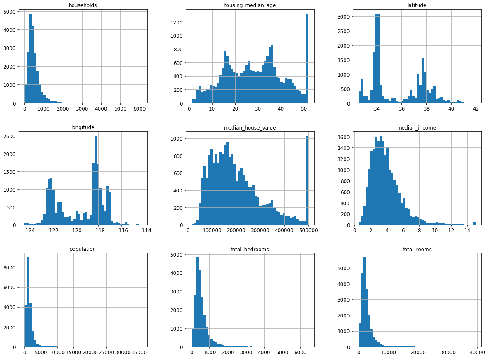
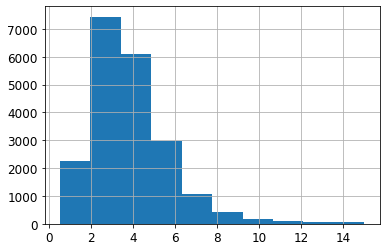
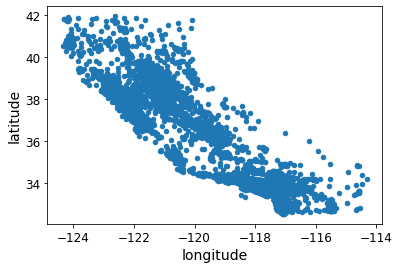
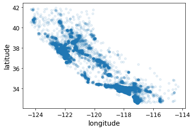
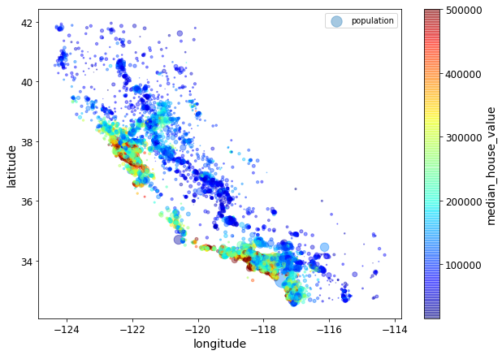
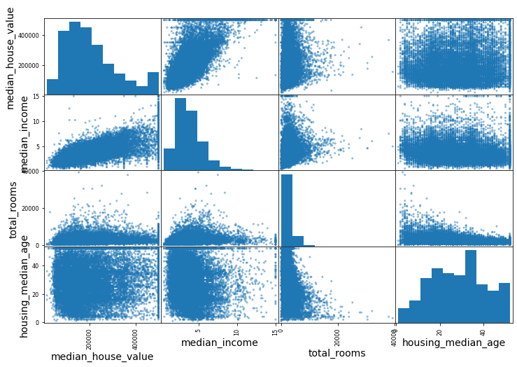
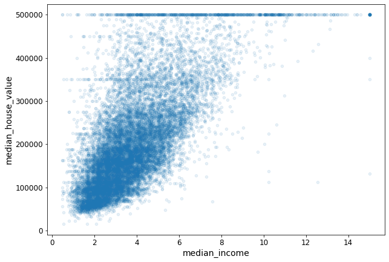

#### First, let's make sure this notebook works well in both python 2 and 3, import a few common modules, ensure MatplotLib plots figures inline and prepare a function to save the figures:


```python
# To support both python 2 and python 3
from __future__ import division, print_function, unicode_literals

# Common imports
import numpy as np
import os

# to make this notebook's output stable across runs
np.random.seed(42)

# To plot pretty figures
%matplotlib inline
import matplotlib as mpl
import matplotlib.pyplot as plt
mpl.rc('axes', labelsize=14)
mpl.rc('xtick', labelsize=12)
mpl.rc('ytick', labelsize=12)
```

# Download the data of housing prices


```python

import os
import tarfile
from six.moves import urllib

DOWNLOAD_ROOT = "https://raw.githubusercontent.com/ageron/handson-ml/master/"
HOUSING_PATH = os.path.join("datasets", "")
HOUSING_URL = DOWNLOAD_ROOT + "datasets/housing/housing.tgz"

def fetch_housing_data(housing_url=HOUSING_URL, housing_path=HOUSING_PATH):
    os.makedirs(housing_path, exist_ok=True)
    tgz_path = os.path.join(housing_path, "housing.tgz")
    urllib.request.urlretrieve(housing_url, tgz_path)
    housing_tgz = tarfile.open(tgz_path)
    housing_tgz.extractall(path=housing_path)
    housing_tgz.close()
```


```python
fetch_housing_data()
```


```python
import pandas as pd

def load_housing_data(housing_path=HOUSING_PATH):
    csv_path = os.path.join(housing_path, "housing.csv")
    return pd.read_csv(csv_path)
```


```python
housing = load_housing_data()
housing.head()

```


<div>
<style scoped>
    .dataframe tbody tr th:only-of-type {
        vertical-align: middle;
    }

    .dataframe tbody tr th {
        vertical-align: top;
    }

    .dataframe thead th {
        text-align: right;
    }
</style>
<table border="1" class="dataframe">
  <thead>
    <tr style="text-align: right;">
      <th></th>
      <th>longitude</th>
      <th>latitude</th>
      <th>housing_median_age</th>
      <th>total_rooms</th>
      <th>total_bedrooms</th>
      <th>population</th>
      <th>households</th>
      <th>median_income</th>
      <th>median_house_value</th>
      <th>ocean_proximity</th>
    </tr>
  </thead>
  <tbody>
    <tr>
      <th>0</th>
      <td>-122.23</td>
      <td>37.88</td>
      <td>41.0</td>
      <td>880.0</td>
      <td>129.0</td>
      <td>322.0</td>
      <td>126.0</td>
      <td>8.3252</td>
      <td>452600.0</td>
      <td>NEAR BAY</td>
    </tr>
    <tr>
      <th>1</th>
      <td>-122.22</td>
      <td>37.86</td>
      <td>21.0</td>
      <td>7099.0</td>
      <td>1106.0</td>
      <td>2401.0</td>
      <td>1138.0</td>
      <td>8.3014</td>
      <td>358500.0</td>
      <td>NEAR BAY</td>
    </tr>
    <tr>
      <th>2</th>
      <td>-122.24</td>
      <td>37.85</td>
      <td>52.0</td>
      <td>1467.0</td>
      <td>190.0</td>
      <td>496.0</td>
      <td>177.0</td>
      <td>7.2574</td>
      <td>352100.0</td>
      <td>NEAR BAY</td>
    </tr>
    <tr>
      <th>3</th>
      <td>-122.25</td>
      <td>37.85</td>
      <td>52.0</td>
      <td>1274.0</td>
      <td>235.0</td>
      <td>558.0</td>
      <td>219.0</td>
      <td>5.6431</td>
      <td>341300.0</td>
      <td>NEAR BAY</td>
    </tr>
    <tr>
      <th>4</th>
      <td>-122.25</td>
      <td>37.85</td>
      <td>52.0</td>
      <td>1627.0</td>
      <td>280.0</td>
      <td>565.0</td>
      <td>259.0</td>
      <td>3.8462</td>
      <td>342200.0</td>
      <td>NEAR BAY</td>
    </tr>
  </tbody>
</table>
</div>


```python
housing.info()
```

    <class 'pandas.core.frame.DataFrame'>
    RangeIndex: 20640 entries, 0 to 20639
    Data columns (total 10 columns):
     #   Column              Non-Null Count  Dtype  
    ---  ------              --------------  -----  
     0   longitude           20640 non-null  float64
     1   latitude            20640 non-null  float64
     2   housing_median_age  20640 non-null  float64
     3   total_rooms         20640 non-null  float64
     4   total_bedrooms      20433 non-null  float64
     5   population          20640 non-null  float64
     6   households          20640 non-null  float64
     7   median_income       20640 non-null  float64
     8   median_house_value  20640 non-null  float64
     9   ocean_proximity     20640 non-null  object 
    dtypes: float64(9), object(1)
    memory usage: 1.6+ MB
    

######  Notice that the total_bedrooms attribute has only 20,433 nonnull values, meaning that 207 districts are missing this feature. We will need to take care of this later.


```python
housing["ocean_proximity"].value_counts() #to know how many dis belong to each category
```


    <1H OCEAN     9136
    INLAND        6551
    NEAR OCEAN    2658
    NEAR BAY      2290
    ISLAND           5
    Name: ocean_proximity, dtype: int64


# Description of the dataset


```python
housing.describe()
```


<div>
<style scoped>
    .dataframe tbody tr th:only-of-type {
        vertical-align: middle;
    }

    .dataframe tbody tr th {
        vertical-align: top;
    }

    .dataframe thead th {
        text-align: right;
    }
</style>
<table border="1" class="dataframe">
  <thead>
    <tr style="text-align: right;">
      <th></th>
      <th>longitude</th>
      <th>latitude</th>
      <th>housing_median_age</th>
      <th>total_rooms</th>
      <th>total_bedrooms</th>
      <th>population</th>
      <th>households</th>
      <th>median_income</th>
      <th>median_house_value</th>
    </tr>
  </thead>
  <tbody>
    <tr>
      <th>count</th>
      <td>20640.000000</td>
      <td>20640.000000</td>
      <td>20640.000000</td>
      <td>20640.000000</td>
      <td>20433.000000</td>
      <td>20640.000000</td>
      <td>20640.000000</td>
      <td>20640.000000</td>
      <td>20640.000000</td>
    </tr>
    <tr>
      <th>mean</th>
      <td>-119.569704</td>
      <td>35.631861</td>
      <td>28.639486</td>
      <td>2635.763081</td>
      <td>537.870553</td>
      <td>1425.476744</td>
      <td>499.539680</td>
      <td>3.870671</td>
      <td>206855.816909</td>
    </tr>
    <tr>
      <th>std</th>
      <td>2.003532</td>
      <td>2.135952</td>
      <td>12.585558</td>
      <td>2181.615252</td>
      <td>421.385070</td>
      <td>1132.462122</td>
      <td>382.329753</td>
      <td>1.899822</td>
      <td>115395.615874</td>
    </tr>
    <tr>
      <th>min</th>
      <td>-124.350000</td>
      <td>32.540000</td>
      <td>1.000000</td>
      <td>2.000000</td>
      <td>1.000000</td>
      <td>3.000000</td>
      <td>1.000000</td>
      <td>0.499900</td>
      <td>14999.000000</td>
    </tr>
    <tr>
      <th>25%</th>
      <td>-121.800000</td>
      <td>33.930000</td>
      <td>18.000000</td>
      <td>1447.750000</td>
      <td>296.000000</td>
      <td>787.000000</td>
      <td>280.000000</td>
      <td>2.563400</td>
      <td>119600.000000</td>
    </tr>
    <tr>
      <th>50%</th>
      <td>-118.490000</td>
      <td>34.260000</td>
      <td>29.000000</td>
      <td>2127.000000</td>
      <td>435.000000</td>
      <td>1166.000000</td>
      <td>409.000000</td>
      <td>3.534800</td>
      <td>179700.000000</td>
    </tr>
    <tr>
      <th>75%</th>
      <td>-118.010000</td>
      <td>37.710000</td>
      <td>37.000000</td>
      <td>3148.000000</td>
      <td>647.000000</td>
      <td>1725.000000</td>
      <td>605.000000</td>
      <td>4.743250</td>
      <td>264725.000000</td>
    </tr>
    <tr>
      <th>max</th>
      <td>-114.310000</td>
      <td>41.950000</td>
      <td>52.000000</td>
      <td>39320.000000</td>
      <td>6445.000000</td>
      <td>35682.000000</td>
      <td>6082.000000</td>
      <td>15.000100</td>
      <td>500001.000000</td>
    </tr>
  </tbody>
</table>
</div>


###### The count, mean, min, and max rows are self-explanatory. Note that the null values are ignored (so, for example, count of total_bedrooms is 20,433, not 20,640). The std row shows the standard deviation (which measures how dispersed the values are). The 25%, 50%, and 75% rows show the corresponding percentiles: a percentile indicates the value below which a given percentage of observations in a group of observations falls. For example, 25% of the districts have a housing_median_age lower than 18, while 50% are lower than 29 and 75% are lower than 37. These are often called the 25th percentile (or 1st quartile), the median, and the 75th percentile (or 3rd quartile).

# Plot Histogram


```python

import matplotlib.pyplot as plt
housing.hist(bins=50, figsize=(20,15))
plt.show()
```





# Create Test set
##### Creating a test set is theoretically quite simple: just pick some instances randomly, typically 20% of the dataset, and set them aside


```python
from sklearn.model_selection import train_test_split
train_set, test_set = train_test_split(housing, test_size=0.2, random_state=42)
```


```python
train_set.head()

```


<div>
<style scoped>
    .dataframe tbody tr th:only-of-type {
        vertical-align: middle;
    }

    .dataframe tbody tr th {
        vertical-align: top;
    }

    .dataframe thead th {
        text-align: right;
    }
</style>
<table border="1" class="dataframe">
  <thead>
    <tr style="text-align: right;">
      <th></th>
      <th>longitude</th>
      <th>latitude</th>
      <th>housing_median_age</th>
      <th>total_rooms</th>
      <th>total_bedrooms</th>
      <th>population</th>
      <th>households</th>
      <th>median_income</th>
      <th>median_house_value</th>
      <th>ocean_proximity</th>
    </tr>
  </thead>
  <tbody>
    <tr>
      <th>14196</th>
      <td>-117.03</td>
      <td>32.71</td>
      <td>33.0</td>
      <td>3126.0</td>
      <td>627.0</td>
      <td>2300.0</td>
      <td>623.0</td>
      <td>3.2596</td>
      <td>103000.0</td>
      <td>NEAR OCEAN</td>
    </tr>
    <tr>
      <th>8267</th>
      <td>-118.16</td>
      <td>33.77</td>
      <td>49.0</td>
      <td>3382.0</td>
      <td>787.0</td>
      <td>1314.0</td>
      <td>756.0</td>
      <td>3.8125</td>
      <td>382100.0</td>
      <td>NEAR OCEAN</td>
    </tr>
    <tr>
      <th>17445</th>
      <td>-120.48</td>
      <td>34.66</td>
      <td>4.0</td>
      <td>1897.0</td>
      <td>331.0</td>
      <td>915.0</td>
      <td>336.0</td>
      <td>4.1563</td>
      <td>172600.0</td>
      <td>NEAR OCEAN</td>
    </tr>
    <tr>
      <th>14265</th>
      <td>-117.11</td>
      <td>32.69</td>
      <td>36.0</td>
      <td>1421.0</td>
      <td>367.0</td>
      <td>1418.0</td>
      <td>355.0</td>
      <td>1.9425</td>
      <td>93400.0</td>
      <td>NEAR OCEAN</td>
    </tr>
    <tr>
      <th>2271</th>
      <td>-119.80</td>
      <td>36.78</td>
      <td>43.0</td>
      <td>2382.0</td>
      <td>431.0</td>
      <td>874.0</td>
      <td>380.0</td>
      <td>3.5542</td>
      <td>96500.0</td>
      <td>INLAND</td>
    </tr>
  </tbody>
</table>
</div>


# Histogram of an Important feature 


```python
housing["median_income"].hist()
plt.show()
```





```python
housing["income_cat"] = pd.cut(housing["median_income"],
bins=[0., 1.5, 3.0, 4.5, 6., np.inf],
labels=[1, 2, 3, 4, 5])
```


```python
housing["income_cat"].hist()
plt.show()
```


# Stratified Sampling:
##### According to Wikipedia, "in statistics, stratified sampling is a method of sampling from a population which can be partitioned into subpopulations." This method of sampling can be advantageous because it tries to keep in the sample the same proportion of each desired variable (strata) that is present in the population.

##### Now you are ready to do stratified sampling based on the income category. For this you can use Scikit-Learn’s StratifiedShuffleSplit class


```python
from sklearn.model_selection import StratifiedShuffleSplit
split = StratifiedShuffleSplit(n_splits=1, test_size=0.2, random_state=42)
for train_index, test_index in split.split(housing, housing["income_cat"]):
    strat_train_set = housing.loc[train_index]
    strat_test_set = housing.loc[test_index]
strat_test_set["income_cat"].value_counts() / len(strat_test_set) 

```


    3    0.350533
    2    0.318798
    4    0.176357
    5    0.114583
    1    0.039729
    Name: income_cat, dtype: float64


```python
len(strat_test_set)
```


    4128


```python
strat_test_set["income_cat"].value_counts()
```


    3    1447
    2    1316
    4     728
    5     473
    1     164
    Name: income_cat, dtype: int64


### Checking similarity with income attribute(Goal of stratifiedSplit)


```python
housing["income_cat"].value_counts() / len(housing)

```


    3    0.350581
    2    0.318847
    4    0.176308
    5    0.114438
    1    0.039826
    Name: income_cat, dtype: float64


```python

# Now you should remove the income_cat attribute so the data is back to its original state:
for set in (strat_train_set, strat_test_set):
    set.drop(["income_cat"], axis=1, inplace=True)
```


```python
#Let’s create a copy so you can play with it without harming the training set:
housing = strat_train_set.copy()
```

## Since there is geographical information (latitude and longitude), it is a good idea to create a scatterplot of all districts to visualize the data


```python
housing.plot(kind="scatter", x="longitude", y="latitude")
plt.show()
```





## What do you think is the data Clear now ??


```python
housing.plot(kind="scatter", x="longitude", y="latitude", alpha=0.1) 
```


    <matplotlib.axes._subplots.AxesSubplot at 0x26e1ca7f4f0>





#### The radius of each circle represents the district’spopulation (option s), and the color represents the price (option c).
#### This image tells you that the housing prices are very much related to the location (e.g., close to the ocean) and to the population density, as you probably knew already. It will probably be useful to use a clustering algorithm to detect the main clusters, and add new features that measure the proximity to the cluster centers.


```python
housing.plot(kind="scatter", x="longitude", y="latitude", alpha=0.4,
    s=housing["population"]/100, label="population", figsize=(10,7),
    c="median_house_value", cmap=plt.get_cmap("jet"), colorbar=True,
    sharex=False)
plt.legend()
```


    <matplotlib.legend.Legend at 0x26e1fd96be0>





#### Since the dataset is not too large, you can easily compute the standard correlation coefficient (also called Pearson’s r) between every pair of attributes using the corr() method:

##### A value of exactly 1.0 means there is a perfect positive relationship between the two variables. For a positive increase in one variable, there is also a positive increase in the second variable. A value of -1.0 means there is a perfect negative relationship between the two variables. If the correlation between two variables is 0, there is no linear relationship between them. 


```python
corr_matrix = housing.corr()
# let`s see now how much correlation between the attributes and median house value
corr_matrix["median_house_value"].sort_values(ascending=False)
```


    median_house_value    1.000000
    median_income         0.687160
    total_rooms           0.135097
    housing_median_age    0.114110
    households            0.064506
    total_bedrooms        0.047689
    population           -0.026920
    longitude            -0.047432
    latitude             -0.142724
    Name: median_house_value, dtype: float64


### The correlation coefficient ranges from –1 to 1. When it is close to 1, it means that there is a strong positive correlation; for example, the median house value tends to go up when the median income goes up


```python
# correlation calculation using pandas` scatter matrix function
from pandas.plotting import scatter_matrix

attributes = ["median_house_value", "median_income", "total_rooms",
              "housing_median_age"]
scatter_matrix(housing[attributes], figsize=(12, 8))
plt.show()
```





# What do you think of the diagonal

### The main diagonal (top left to bottom right) would be full of straight lines if Pandas plotted each variable against itself, which would not be very useful. So instead Pandas displays a histogram of each attribute


```python
# The most promising attribute to predict the median house value is the median income, so let’s zoom in on
# their correlation scatterplot 
housing.plot(kind="scatter", x="median_income", y="median_house_value", figsize=(10,7),alpha=0.1)
```


    <matplotlib.axes._subplots.AxesSubplot at 0x26e1cbcb970>





##### This plot reveals a few things. First, the correlation is indeed very strong; you can clearly see the upward trend and the points are not too dispersed.

#### One last thing you may want to do before actually preparing the data for Machine Learning algorithms is to try out various attribute combinations. For example, the total number of rooms in a district is not very useful if you don’t know how many households there are. What you really want is the number of rooms per household. Similarly, the total number of bedrooms by itself is not very useful: you probably want to compare it to the number of rooms. And the population per household also seems like an interesting attribute combination to look at. Let’s create these new attributes:


```python
housing["rooms_per_household"] = housing["total_rooms"]/housing["households"]
housing["bedrooms_per_room"] = housing["total_bedrooms"]/housing["total_rooms"]
housing["population_per_household"]=housing["population"]/housing["households"]
corr_matrix = housing.corr()
corr_matrix["median_house_value"].sort_values(ascending=False)
```


    median_house_value          1.000000
    median_income               0.687160
    rooms_per_household         0.146285
    total_rooms                 0.135097
    housing_median_age          0.114110
    households                  0.064506
    total_bedrooms              0.047689
    population_per_household   -0.021985
    population                 -0.026920
    longitude                  -0.047432
    latitude                   -0.142724
    bedrooms_per_room          -0.259984
    Name: median_house_value, dtype: float64


##### But first let’s revert to a clean training set (by copying strat_train_set once again), and let’s separate the predictors and the labels since we don’t necessarily want to apply the same transformations to the predictors and the target values (note that drop() creates a copy of the data and does not affect strat_train_set):


```python
housing = strat_train_set.drop("median_house_value", axis=1)
housing_labels = strat_train_set["median_house_value"].copy()
```

# Data Cleaning

###### Most Machine Learning algorithms cannot work with missing features, so let’s create a few functions to take care of them. You noticed earlier that the total_bedrooms attribute has some missing values.


```python
# find nan values
sample_incomplete_rows = housing[housing.isnull().any(axis=1)].head()
sample_incomplete_rows
```


<div>
<style scoped>
    .dataframe tbody tr th:only-of-type {
        vertical-align: middle;
    }

    .dataframe tbody tr th {
        vertical-align: top;
    }

    .dataframe thead th {
        text-align: right;
    }
</style>
<table border="1" class="dataframe">
  <thead>
    <tr style="text-align: right;">
      <th></th>
      <th>longitude</th>
      <th>latitude</th>
      <th>housing_median_age</th>
      <th>total_rooms</th>
      <th>total_bedrooms</th>
      <th>population</th>
      <th>households</th>
      <th>median_income</th>
      <th>ocean_proximity</th>
    </tr>
  </thead>
  <tbody>
    <tr>
      <th>4629</th>
      <td>-118.30</td>
      <td>34.07</td>
      <td>18.0</td>
      <td>3759.0</td>
      <td>NaN</td>
      <td>3296.0</td>
      <td>1462.0</td>
      <td>2.2708</td>
      <td>&lt;1H OCEAN</td>
    </tr>
    <tr>
      <th>6068</th>
      <td>-117.86</td>
      <td>34.01</td>
      <td>16.0</td>
      <td>4632.0</td>
      <td>NaN</td>
      <td>3038.0</td>
      <td>727.0</td>
      <td>5.1762</td>
      <td>&lt;1H OCEAN</td>
    </tr>
    <tr>
      <th>17923</th>
      <td>-121.97</td>
      <td>37.35</td>
      <td>30.0</td>
      <td>1955.0</td>
      <td>NaN</td>
      <td>999.0</td>
      <td>386.0</td>
      <td>4.6328</td>
      <td>&lt;1H OCEAN</td>
    </tr>
    <tr>
      <th>13656</th>
      <td>-117.30</td>
      <td>34.05</td>
      <td>6.0</td>
      <td>2155.0</td>
      <td>NaN</td>
      <td>1039.0</td>
      <td>391.0</td>
      <td>1.6675</td>
      <td>INLAND</td>
    </tr>
    <tr>
      <th>19252</th>
      <td>-122.79</td>
      <td>38.48</td>
      <td>7.0</td>
      <td>6837.0</td>
      <td>NaN</td>
      <td>3468.0</td>
      <td>1405.0</td>
      <td>3.1662</td>
      <td>&lt;1H OCEAN</td>
    </tr>
  </tbody>
</table>
</div>


```python
# housing.dropna(subset=["total_bedrooms"]) # option 1: will drop the whole row containing nan value
# housing.drop("total_bedrooms", axis=1) # option 2: drop the whole column
median = housing["total_bedrooms"].median() 
housing["total_bedrooms"].fillna(median) # option 3: fill the nan values places wit median

```


    17606     351.0
    18632     108.0
    14650     471.0
    3230      371.0
    3555     1525.0
              ...  
    6563      236.0
    12053     294.0
    13908     872.0
    11159     380.0
    15775     682.0
    Name: total_bedrooms, Length: 16512, dtype: float64


##### Don’t forget to save the median value that you have computed. You will need it later to replace missing values in the test set when you want to evaluate your system, and also once the system goes live to replace missing values in new data.

#### Scikit-Learn provides a handy class to take care of missing values: SimpleImputer. Here is how to use it. First, you need to create a SimpleImputer instance, specifying that you want to replace each attribute’s missing values with the median of that attribute:


```python
from sklearn.impute import SimpleImputer
imputer = SimpleImputer(strategy="median")
```

#### Since the median can only be computed on numerical attributes, we need to create acopy of the data without the text attribute ocean_proximity:


```python
housing_num = housing.drop('ocean_proximity', axis=1)
imputer.fit(housing_num)
```


    SimpleImputer(strategy='median')


The imputer has simply computed the median of each attribute and stored the result
in its statistics_ instance variable. Only the total_bedrooms attribute had missing
values, but we cannot be sure that there won’t be any missing values in new data after
the system goes live, so it is safer to apply the imputer to all the numerical attributes:


```python
imputer.statistics_

```


    array([-118.51  ,   34.26  ,   29.    , 2119.5   ,  433.    , 1164.    ,
            408.    ,    3.5409])


```python
housing_num.median().values
```


    array([-118.51  ,   34.26  ,   29.    , 2119.5   ,  433.    , 1164.    ,
            408.    ,    3.5409])


# Handling Text and Categorical Attributes


```python
housing_cat = housing[['ocean_proximity']]
housing_cat.head(10)
```


<div>
<style scoped>
    .dataframe tbody tr th:only-of-type {
        vertical-align: middle;
    }

    .dataframe tbody tr th {
        vertical-align: top;
    }

    .dataframe thead th {
        text-align: right;
    }
</style>
<table border="1" class="dataframe">
  <thead>
    <tr style="text-align: right;">
      <th></th>
      <th>ocean_proximity</th>
    </tr>
  </thead>
  <tbody>
    <tr>
      <th>17606</th>
      <td>&lt;1H OCEAN</td>
    </tr>
    <tr>
      <th>18632</th>
      <td>&lt;1H OCEAN</td>
    </tr>
    <tr>
      <th>14650</th>
      <td>NEAR OCEAN</td>
    </tr>
    <tr>
      <th>3230</th>
      <td>INLAND</td>
    </tr>
    <tr>
      <th>3555</th>
      <td>&lt;1H OCEAN</td>
    </tr>
    <tr>
      <th>19480</th>
      <td>INLAND</td>
    </tr>
    <tr>
      <th>8879</th>
      <td>&lt;1H OCEAN</td>
    </tr>
    <tr>
      <th>13685</th>
      <td>INLAND</td>
    </tr>
    <tr>
      <th>4937</th>
      <td>&lt;1H OCEAN</td>
    </tr>
    <tr>
      <th>4861</th>
      <td>&lt;1H OCEAN</td>
    </tr>
  </tbody>
</table>
</div>


Most Machine Learning algorithms prefer to work with numbers anyway, so let’s convert
these categories from text to numbers. For this, we can use Scikit-Learn’s Ordina
lEncoder class


```python
 try:
    from sklearn.preprocessing import OrdinalEncoder
except ImportError:
    from future_encoders import OrdinalEncoder # Scikit-Learn < 0.20
    
ordinal_encoder = OrdinalEncoder()
housing_cat_encoded = ordinal_encoder.fit_transform(housing_cat)
housing_cat_encoded[:10]
```


    array([[0.],
           [0.],
           [4.],
           [1.],
           [0.],
           [1.],
           [0.],
           [1.],
           [0.],
           [0.]])


```python
ordinal_encoder.categories_
```


    [array(['<1H OCEAN', 'INLAND', 'ISLAND', 'NEAR BAY', 'NEAR OCEAN'],
           dtype=object)]


```python
try:
    from sklearn.preprocessing import OrdinalEncoder # just to raise an ImportError if Scikit-Learn < 0.20
    from sklearn.preprocessing import OneHotEncoder
except ImportError:
    from future_encoders import OneHotEncoder # Scikit-Learn < 0.20

cat_encoder = OneHotEncoder()
housing_cat_1hot = cat_encoder.fit_transform(housing_cat)
housing_cat_1hot
```


    <16512x5 sparse matrix of type '<class 'numpy.float64'>'
    	with 16512 stored elements in Compressed Sparse Row format>


```python
housing_cat_1hot.toarray()
```


    array([[1., 0., 0., 0., 0.],
           [1., 0., 0., 0., 0.],
           [0., 0., 0., 0., 1.],
           ...,
           [0., 1., 0., 0., 0.],
           [1., 0., 0., 0., 0.],
           [0., 0., 0., 1., 0.]])


```python
################################################
```


```python

```

# Custom Transformers


```python
housing.columns

```


    Index(['longitude', 'latitude', 'housing_median_age', 'total_rooms',
           'total_bedrooms', 'population', 'households', 'median_income',
           'ocean_proximity'],
          dtype='object')


```python
# get attribute index
rooms_ix, bedrooms_ix, population_ix, household_ix = [
    list(housing.columns).index(col)
    for col in ("total_rooms", "total_bedrooms", "population", "households")]
```


```python
from sklearn.preprocessing import FunctionTransformer

def add_extra_features(X, add_bedrooms_per_room=True):
    rooms_per_household = X[:, rooms_ix] / X[:, household_ix]
    population_per_household = X[:, population_ix] / X[:, household_ix]
    return np.c_[X, rooms_per_household, population_per_household]

attr_adder = FunctionTransformer(add_extra_features, validate=False)
housing_extra_attribs = attr_adder.fit_transform(housing.values)
```


```python
housing_extra_attribs = pd.DataFrame(
    housing_extra_attribs,
    columns=list(housing.columns)+["rooms_per_household", "population_per_household"],
    index=housing.index)
housing_extra_attribs.head()
```


<div>
<style scoped>
    .dataframe tbody tr th:only-of-type {
        vertical-align: middle;
    }

    .dataframe tbody tr th {
        vertical-align: top;
    }

    .dataframe thead th {
        text-align: right;
    }
</style>
<table border="1" class="dataframe">
  <thead>
    <tr style="text-align: right;">
      <th></th>
      <th>longitude</th>
      <th>latitude</th>
      <th>housing_median_age</th>
      <th>total_rooms</th>
      <th>total_bedrooms</th>
      <th>population</th>
      <th>households</th>
      <th>median_income</th>
      <th>ocean_proximity</th>
      <th>rooms_per_household</th>
      <th>population_per_household</th>
    </tr>
  </thead>
  <tbody>
    <tr>
      <th>17606</th>
      <td>-121.89</td>
      <td>37.29</td>
      <td>38</td>
      <td>1568</td>
      <td>351</td>
      <td>710</td>
      <td>339</td>
      <td>2.7042</td>
      <td>&lt;1H OCEAN</td>
      <td>4.62537</td>
      <td>2.0944</td>
    </tr>
    <tr>
      <th>18632</th>
      <td>-121.93</td>
      <td>37.05</td>
      <td>14</td>
      <td>679</td>
      <td>108</td>
      <td>306</td>
      <td>113</td>
      <td>6.4214</td>
      <td>&lt;1H OCEAN</td>
      <td>6.00885</td>
      <td>2.70796</td>
    </tr>
    <tr>
      <th>14650</th>
      <td>-117.2</td>
      <td>32.77</td>
      <td>31</td>
      <td>1952</td>
      <td>471</td>
      <td>936</td>
      <td>462</td>
      <td>2.8621</td>
      <td>NEAR OCEAN</td>
      <td>4.22511</td>
      <td>2.02597</td>
    </tr>
    <tr>
      <th>3230</th>
      <td>-119.61</td>
      <td>36.31</td>
      <td>25</td>
      <td>1847</td>
      <td>371</td>
      <td>1460</td>
      <td>353</td>
      <td>1.8839</td>
      <td>INLAND</td>
      <td>5.23229</td>
      <td>4.13598</td>
    </tr>
    <tr>
      <th>3555</th>
      <td>-118.59</td>
      <td>34.23</td>
      <td>17</td>
      <td>6592</td>
      <td>1525</td>
      <td>4459</td>
      <td>1463</td>
      <td>3.0347</td>
      <td>&lt;1H OCEAN</td>
      <td>4.50581</td>
      <td>3.04785</td>
    </tr>
  </tbody>
</table>
</div>


# pipeline and feature scaling
There are two common ways to get all attributes to have the same scale: min-max scaling and standardization.

* Min-max scaling (many people call this normalization) is quite simple: values are shifted and rescaled so that they end up ranging from 0 to 1. We do this by subtracting the min value and dividing by the max minus the min. Scikit-Learn provides a transformer called MinMaxScaler for this. It has a feature_range hyperparameter that lets you change the range if you don’t want 0–1 for some reason.
* Standardization is quite different: first it subtracts the mean value (so standardized values always have a zero mean), and then it divides by the variance so that the resulting distribution has unit variance. Unlike min-max scaling, standardization does not bound values to a specific range, which may be a problem for some algorithms (e.g., neural networks often expect an input value ranging from 0 to 1).


```python
from sklearn.pipeline import Pipeline
from sklearn.preprocessing import StandardScaler

num_pipeline = Pipeline([
        ('imputer', SimpleImputer(strategy="median")),
        ('attribs_adder', FunctionTransformer(add_extra_features, validate=False)),
        ('std_scaler', StandardScaler()),
    ])

housing_num_tr = num_pipeline.fit_transform(housing_num)
```


```python
housing_num_tr

```


    array([[-1.15604281,  0.77194962,  0.74333089, ..., -0.61493744,
            -0.31205452, -0.08649871],
           [-1.17602483,  0.6596948 , -1.1653172 , ...,  1.33645936,
             0.21768338, -0.03353391],
           [ 1.18684903, -1.34218285,  0.18664186, ..., -0.5320456 ,
            -0.46531516, -0.09240499],
           ...,
           [ 1.58648943, -0.72478134, -1.56295222, ..., -0.3167053 ,
             0.3469342 , -0.03055414],
           [ 0.78221312, -0.85106801,  0.18664186, ...,  0.09812139,
             0.02499488,  0.06150916],
           [-1.43579109,  0.99645926,  1.85670895, ..., -0.15779865,
            -0.22852947, -0.09586294]])


```python
try:
    from sklearn.compose import ColumnTransformer
except ImportError:
    from future_encoders import ColumnTransformer # Scikit-Learn < 0.20
    
num_attribs = list(housing_num)
cat_attribs = ["ocean_proximity"]

full_pipeline = ColumnTransformer([
        ("num", num_pipeline, num_attribs),
        ("cat", OneHotEncoder(), cat_attribs),
    ])

housing_prepared = full_pipeline.fit_transform(housing)
housing_prepared
```


    array([[-1.15604281,  0.77194962,  0.74333089, ...,  0.        ,
             0.        ,  0.        ],
           [-1.17602483,  0.6596948 , -1.1653172 , ...,  0.        ,
             0.        ,  0.        ],
           [ 1.18684903, -1.34218285,  0.18664186, ...,  0.        ,
             0.        ,  1.        ],
           ...,
           [ 1.58648943, -0.72478134, -1.56295222, ...,  0.        ,
             0.        ,  0.        ],
           [ 0.78221312, -0.85106801,  0.18664186, ...,  0.        ,
             0.        ,  0.        ],
           [-1.43579109,  0.99645926,  1.85670895, ...,  0.        ,
             1.        ,  0.        ]])


```python
housing_prepared.shape

```


    (16512, 15)


```python
from sklearn.linear_model import LinearRegression
lin_reg = LinearRegression()
lin_reg.fit(housing_prepared, housing_labels)
```


    LinearRegression()


```python

# let's try the full preprocessing pipeline on a few training instances
some_data = housing.iloc[:5]
some_labels = housing_labels.iloc[:5]
some_data_prepared = full_pipeline.transform(some_data)

print("Predictions:", lin_reg.predict(some_data_prepared))
```

    Predictions: [211888.26540421 321274.25149998 210853.46010112  62261.10820843
     194921.76527689]
    


```python
print("Labels:", list(some_labels))

```

    Labels: [286600.0, 340600.0, 196900.0, 46300.0, 254500.0]
    


```python
# chec mean square error between predictions and labels
from sklearn.metrics import mean_squared_error

housing_predictions = lin_reg.predict(housing_prepared)
lin_mse = mean_squared_error(housing_labels, housing_predictions)
lin_rmse = np.sqrt(lin_mse)
lin_rmse
```


    68911.7605423384


```python

```
